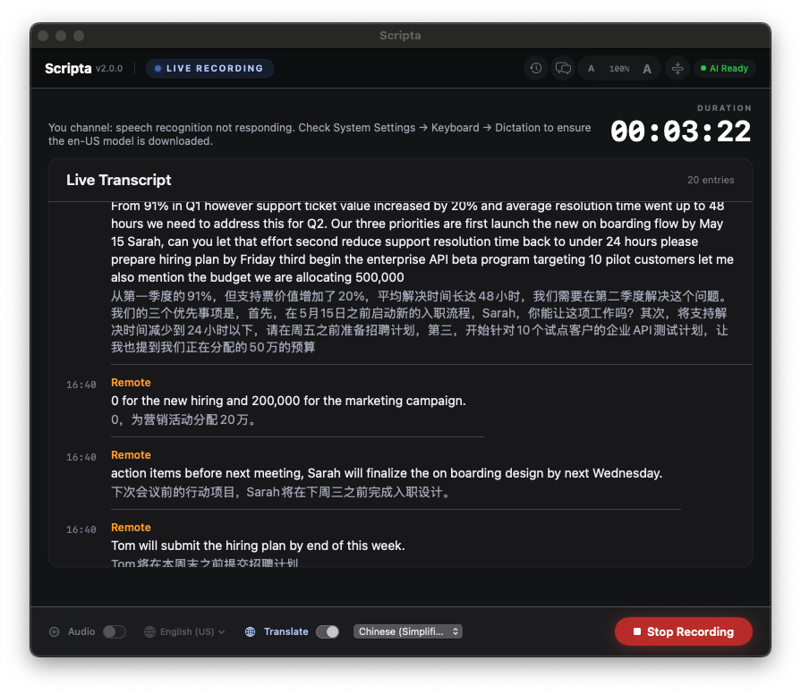
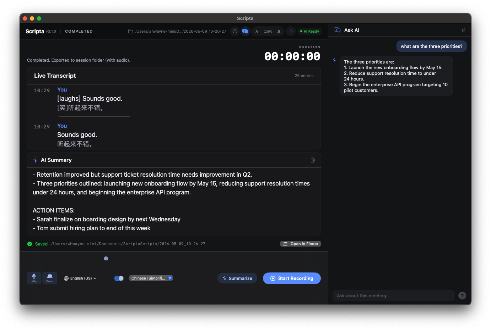
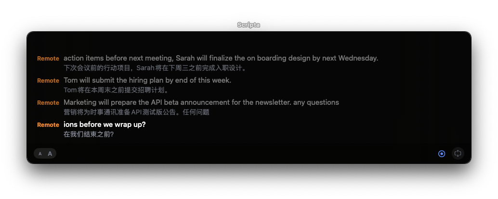
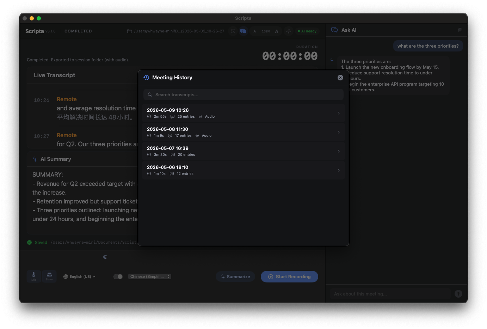

<p align="center">
  
</p>

<h1 align="center">Scripta</h1>

<p align="center">
  <strong>Privacy-first meeting transcription & AI summary for macOS</strong>
</p>

<p align="center">
  <a href="#features">Features</a> •
  <a href="#screenshots">Screenshots</a> •
  <a href="#installation">Installation</a> •
  <a href="#requirements">Requirements</a> •
  <a href="#building-from-source">Build</a> •
  <a href="CONTRIBUTING.md">Contributing</a> •
  <a href="#license">License</a>
</p>

<p align="center">
  
  
  
  
  
</p>

<p align="center">
  
</p>

---

Scripta is a native macOS app that captures **both your microphone and system audio** during meetings, transcribes them in real-time, and generates AI-powered summaries — all running **100% locally** on your Mac. No cloud. No subscriptions. No data leaves your machine.

- **Mic** transcription powered by [whisper.cpp](https://github.com/ggerganov/whisper.cpp) (Metal-accelerated, on-device)
- **System audio** transcription via Apple `SFSpeechRecognizer` (on-device)
- **AI summaries & chat** via [Ollama](https://ollama.com) (local LLM)

## Features

**Dual-Channel Real-time Transcription**
- Mic ("You") via whisper.cpp — 100% local, Metal-accelerated on Apple Silicon
- System audio ("Remote") via Apple on-device speech recognition
- Supports 10+ languages (English, Chinese, Japanese, Korean, Spanish, French, German, and more)
- Mic mute button — instantly pause/resume mic recording during a session

**AI-Powered Summaries**
- Local AI summaries powered by [Ollama](https://ollama.com)
- Key points + action items extraction
- Streaming responses displayed in real-time

**AI Chat Panel**
- Ask questions about your meeting transcript
- Multi-turn conversation with context
- Works during recording or on completed sessions

**Live Translation** *(macOS 15+)*
- Real-time bilingual transcript using Apple Translation framework
- Context-aware translation for improved quality

**Meeting History**
- Browse and search all past sessions
- View transcripts, summaries, and re-generate with AI
- Audio recordings saved alongside transcripts
- Sessions stored in `~/Documents/ScriptaScripts/`

**Two Display Modes**
- **Full mode**: complete UI with transcript, summary, chat, and controls
- **Minimal mode**: floating live captions bar — stays on top while you work

**Privacy by Design**
- All processing happens on your Mac
- No internet connection required (except for initial model downloads)
- No account, no telemetry, no tracking

## Screenshots

### Full Mode — Live Recording with Translation

<p align="center">
  
</p>

Live dual-channel transcription with bilingual translation. The "Remote" channel captures system audio from any meeting app (Teams, Zoom, Meet, etc.) while "You" captures your microphone via whisper.cpp.

### AI Summary & Chat

<p align="center">
  
</p>

After recording, generate an AI summary with key points and action items using a local Ollama model. The Ask AI chat panel lets you query your transcript in natural language.

### Minimal Mode — Floating Captions

<p align="center">
  
</p>

A compact floating caption bar that stays on top of your other windows — perfect for following along during a meeting without switching apps.

### Meeting History

<p align="center">
  
</p>

Browse all past sessions with duration, entry count, and audio availability. Search transcripts and re-generate summaries at any time.

## Installation

### One-Line Install (recommended)

```bash
curl -fsSL https://raw.githubusercontent.com/thehwang/Scripta/main/scripts/install.sh | bash
```

This single command will:
- Download the latest release for your macOS version
- Install `Scripta.app` to `/Applications`
- Install [Ollama](https://ollama.com) via Homebrew (if not already installed)
- Start Ollama as a background service
- Pull the default AI model (`qwen2.5:3b`)
- Download the Whisper speech model (`ggml-base.bin`, ~142 MB)
- Launch Scripta

### Manual Install

1. Download the latest `.zip` from [Releases](https://github.com/thehwang/Scripta/releases)
2. Extract and move `Scripta.app` to `/Applications`
3. Clear quarantine: `xattr -cr /Applications/Scripta.app`
4. Install Ollama: `brew install ollama && brew services start ollama`
5. Pull a model: `ollama pull qwen2.5:3b`
6. Launch Scripta — it will prompt to download the Whisper model on first run

## Requirements

| Component | Requirement |
|-----------|------------|
| macOS | 14.0 (Sonoma) or later |
| Chip | Apple Silicon (M1/M2/M3/M4) or Intel |
| Ollama | Required for AI summaries and chat |
| Disk | ~2 GB for AI model + ~142 MB for Whisper model |
| Translation | macOS 15+ (Sequoia) for live translation |

## Building from Source

```bash
git clone https://github.com/thehwang/Scripta.git
cd Scripta
make run
```

This will build whisper.cpp as a static library, build the app with Swift Package Manager, sign it with an ad-hoc certificate, and launch it.

### Project Structure

```
Scripta/
├── Sources/
│   ├── Scripta/              # Main app
│   │   ├── AppDelegate.swift
│   │   ├── ContentView.swift        # Main UI (full + minimal modes)
│   │   ├── MeetingRecorder.swift     # Recording orchestration
│   │   ├── WhisperEngine.swift       # whisper.cpp integration for mic ASR
│   │   ├── SystemAudioCapture.swift  # ScreenCaptureKit system audio
│   │   ├── SummaryService.swift      # Ollama AI summary
│   │   ├── ChatPanel.swift           # AI Q&A sidebar
│   │   ├── HistoryPanel.swift        # Meeting history browser
│   │   ├── TranslationService.swift  # Apple Translation wrapper
│   │   ├── MeetingStore.swift        # Session persistence
│   │   └── ...
│   ├── ScriptaCore/          # Shared types (TranscriptEntry, logging)
│   └── CWhisper/             # whisper.cpp C bridging (systemLibrary)
├── screenshots/              # App screenshots for README
├── scripts/
│   └── install.sh            # One-line installer
├── Resources/
│   └── AppIcon.icns
├── Makefile                  # Build, install, deploy targets
└── Package.swift
```

## Permissions

Scripta requires the following macOS permissions (prompted on first launch):

- **Microphone** — to capture your voice
- **Screen Recording** — to capture system/meeting audio via ScreenCaptureKit
- **Speech Recognition** — for on-device transcription

## Legal Notice

> **Recording Disclaimer:** Recording conversations may be subject to local, state, or national consent laws. Many jurisdictions (including parts of the United States, Canada, and the European Union) require **all participants** to be informed and to consent before a conversation is recorded. **You are solely responsible for complying with all applicable laws when using this software.** Scripta does not record by default — recording is explicitly initiated by the user. The developers of Scripta assume no liability for misuse or non-compliance with recording consent laws.

> **Privacy:** Scripta processes all audio and transcription data **entirely on your device**. No audio, transcript, or personal data is transmitted to any external server. AI summaries are generated locally via [Ollama](https://ollama.com). The only network activity is the one-time download of AI and speech models.

## License

[MIT](LICENSE) — free for personal and commercial use.

---

<p align="center">
  Made with ❤️ on a Mac
</p>
